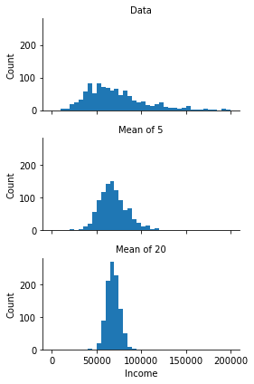
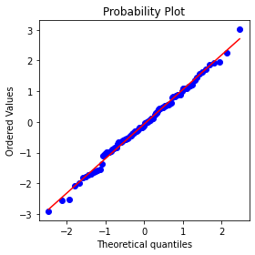
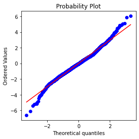
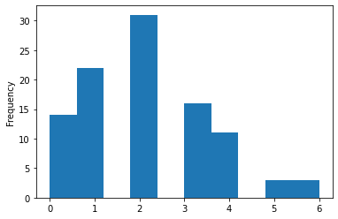
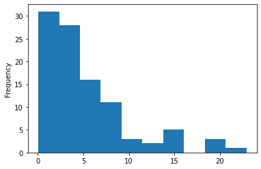

## 2.1 임의표본추출과 표본편향

* 모집단 : 데이터 집합을 구성하는 전체 대상 혹은 집합
* 표본 : 모집단으로부터 부분집합
* 임의표본추출 : 무작위로 표본을 추출하는 것
    * 복원추출 : 중복추출이 가능하도록 해당 샘플을 다시 모집단에 포함
    * 비복원추출 : 한번 뽑힌 원소 추후 추첨에 사용하지 않도록 배제 
* 층화표본추출 : 모집단을 층으로 나눈 뒤 각 층에서 무작위로 표본을 추출하는 것
* 계층 : 공통된 특징 가진 모집단의 동종 하위 그룹
* 단순임의표본 : 모집단 층화없이 임의표본추출로 얻은 표본
* 편향 : 계통상의 오류
* 표본편향 : 모집단을 잘못 대표하는 표본

## 2.2 선택편향
데이터를 의식적이든 무의식적이든 선택적으로 고르는 관행으로 결국 오해의 소지가 있거나 단편적인 결론 얻음
* 선택편향 : 관측 데이터를 선택하는 방식으로 생기는 편향
* 데이터 스누핑 : 흥미로운 것을 찾아 광범위하게 데이터를 살펴보는 것
* 방대한 검색 효과 : 중복 데이터 모델링이나 너무 많은 예측변수 고려하는 모델링에서 비롯된 편향 혹은 비재현성

## 2.3 표본분포 
하나의 동일한 모집단에서 얻은 여러 샘플에 대한 표본통계량의 분포 나타냄 
* 표본통계량 : 더 큰 모집단에서 추출된 표본 데이터들로부터 얻은 측정 지표
* 데이터 분포 : 어떤 데이터 집합에서의 각 개별 값의 도수분포 
* 표본분포 : 여러 표본들 혹은 재표본들로부터 얻은 표본통계량의 도수분포
* 중심극한정리 : 표본 크기 커질수록 표본분포가 정규분포 따르는 경향
* 표준오차 : 여러 표본들로부터 얻은 표본통계량의 변량


```python
%matplotlib inline

from pathlib import Path
import pandas as pd
import numpy as np
from scipy import stats
from sklearn.utils import resample

import seaborn as sns
import matplotlib.pylab as plt
```


```python
try:
    import common
    DATA = common.dataDirectory()
except ImportError:
    DATA = Path().resolve() / 'data'
```


```python
LOANS_INCOME_CSV = DATA / 'loans_income.csv'
SP500_DATA_CSV = DATA / 'sp500_data.csv.gz'
```


```python
loans_income = pd.read_csv('loans_income.csv', squeeze=True)

#1000개 값으로 이뤄진 표본
sample_data = pd.DataFrame({
    'income': loans_income.sample(1000),
    'type': 'Data',
})

#5개 값의 평균으로 1000개로 이뤄진 표본
sample_mean_05 = pd.DataFrame({
    'income': [loans_income.sample(5).mean() for _ in range(1000)],
    'type': 'Mean of 5',
})

#20개값의 평균으로 1000개 이뤄진 표본
sample_mean_20 = pd.DataFrame({
    'income': [loans_income.sample(20).mean() for _ in range(1000)],
    'type': 'Mean of 20',
})

results = pd.concat([sample_data, sample_mean_05, sample_mean_20])
print(results.head())
```

            income  type
    34441  38000.0  Data
    28659  40000.0  Data
    38227  55200.0  Data
    23051  72000.0  Data
    3248   24000.0  Data
    


```python
g = sns.FacetGrid(results, col='type', col_wrap=1, 
                  height=2, aspect=2)
g.map(plt.hist, 'income', range=[0, 200000], bins=40)
g.set_axis_labels('Income', 'Count')
g.set_titles('{col_name}')

plt.tight_layout()
plt.show()
```


    

    


### 2.3.1 중심극한정리
모집단이 정규분포가 아니더라도 표본 크기가 충분하고 데이터가 정규성을 크게 이탈하지 않는 경우 여러 표본에서 추출한 평균은 종 모양의 정규곡선을 이루고 위의 그래프와 같은 경우를 중심극한정리라고 함

### 2.3.2 표준오차
통계에 대한 표본분포의 변동성을 한마디로 말해주는 단일 측정 지표  
표준오차는 표본 값들의 표준편차 s 와 표본크기 n을 기반으로 한 통계량을 이용하여 추정  
  
* n제곱근의 법칙 : 표준오차를 2배로 줄일려명 표본 크기를 4배 증가시켜야함 

표준오차를 구하기 위해서는 새 샘플들을 수집하여 평균을 계산 후 통계량의 표준편차를 계산하지만 이것은 **부트스트랩 재표본**을 사용하여 대체할 수 있음

## 2.4 부트스트랩
관측 데이터 집합으로부터 얻은 복원추출 표본  
모집단에서 추가적으로 표본을 뽑는다고 할 때, 그 표본이 얼마나 원래 표본과 비슷한지 알려줌

## 2.5 신뢰구간
* 신뢰수준 : 같은 모집단으로부터 같은 방식으로 얻은 관심 통계량을 포함할 것으로 예상되는 신뢰구간의 백분율  
     신뢰수준이 높을수록 구간은 넓어짐

## 2.6 정규분포
* 오차 : 데이터 포인트와 예측값 혹은 평균 사이의 차이 
* 표준화하다 :  평균 빼고 표준편차로 나눈다
* Z점수 : 개별 데이터 포인트를 정규화한 결과 
* 표준정규분포 : 평균 = 0 / 표준편차 = 1
* QQ그림 :  표본분포가 특정분포에 얼마나 가까운지 보여주는 그림


```python
fig, ax = plt.subplots(figsize=(4, 4))

norm_sample = stats.norm.rvs(size=100)
stats.probplot(norm_sample, plot=ax)

plt.tight_layout()
plt.show()
```


    

    


## 2.7 긴꼬리분포 

* 꼬리 : 적은 수의 극단값이 주로 존재하는 도수분포의 길고 좁은 부분
* 왜도 : 분포의 한쪽 꼬리가 반대쪽 다른 꼬리보다 긴 정도
    


```python
#넷플릭스의 일일 주식 수익률에 대한 QQ그림 

sp500_px = pd.read_csv('sp500_data.csv')

nflx = sp500_px.NFLX
nflx = np.diff(np.log(nflx[nflx>0]))

fig, ax = plt.subplots(figsize=(4, 4))
stats.probplot(nflx, plot=ax)

plt.tight_layout()
plt.show()
```


    

    


실제 넷플릭스의 주식 수익률을 가지고 그려보았을 때 실제 데이터는 정규분포를 따르지 않음  
데이터가 정규분포 따른다고 예상되는 것보다 훨씬 더 많은 극단값을 관찰할 가능성이 있음을 보여주고 있음  
위의 그래픔는 평균에서 표준편차 이내에 있는 데이터의 점들은 선에 가까이 있다는 것을 알 수 있고 이것은 일반적인 현상

## 2.8 스튜던트의 t분포 
t분포는 정규분포와 생김새가 비슷하지만 꼬리 부분이 약간 더 두껍고 길다  
일반젇으로 t븐포와 같은 모양이며 표본크기에 따라 다른 계열의 t분포가 있고 표본이 클수록 더 정규분포를 닮은 t분포가 형성됨

## 2.9 이항분포
* 시행 : 독립된 결과 가져오는 하나의 사건
* 성공 : 시행에 대한 관심의 결과 
* 이항식 : 두 가지 결과를 갖는다
* 이항시행 : 두 가지 결과 가져오는 시행
* 이항분포 : n번 시행에서 성공한 횟수에 대한 분포

파이썬에서 이항분포의 경우  
**stats.binom.pmf**와 **stats.binom.cdf**를 사용

Q. 한번의 클릭이 판매로 이어질 확률이 0.02일 때, 200회 클릭으로 0회 매출을 관찰할 확률은 얼마인가?


```python
print(stats.binom.pmf(2, n=5, p=0.1))
```

    0.0729
    


```python
print(stats.binom.cdf(2, n=5, p=0.1))
```

    0.99144
    

## 2.10 카이제곱분포
* 기댓값 : 데이터에서 특이하거나 주목할 만한 것이 없다
검정결과가 독립성에 대한 귀무 기댓값에서 벗어난 정도를 측정하는 통계량 

## 2.11 F분포 
그룹 평균 간의 차이가 정규 무작위 변동에서 예상할 수 있는 것보다 얼마나 큰지를 측정하는 것이고 각 그룹내 변동성(잔차변동성)에 대한 그룹 평균 간 변동성의 비율을 의미 
* 비교분석 : 위의 그룹들을 비교하는 것을 말함 

## 2.12 푸아송 분포와 그 외 관련 분포들
* 람다 :  단위시간이나 단위 면적당 사건이 발생하는 비율
* 푸아송 분포 : 표집된 단위 시간 혹은 단위 공간에서 발생한 사건의 도수분포 
* 지수분포 : 한 사건에서 그 다음 사건까지의 시간이나 거리에 대한 도수분포
* 베이블 분포 : 사건 발생률이 시간에 따라 변화하는 지수분포의 일반화된 버전

### 2.12.1 푸아송분포
이전 집계 데이터를 통해 시간 단위 혹은 공간 단위에서의 평균적인 사건의 수를 추정
  (예 : 연간 독감 감염 수에서 일일 감염 혹은 인구 조사 단위당 감염 수 추정)  
시간 단위 또는 공간 단위로 표본들을 수집할 때, 그 사건들의 분포    

Q. 고객 서비스 센터에 1분당 평균 2회로 문의 전화가 접수된다면 이 코드는 100분을 시뮬레이션하여 100분당 문의 전화 횟수는?


```python
stats.poisson.rvs(2,size=100)
```


    array([4, 2, 1, 4, 5, 1, 1, 2, 4, 1, 0, 1, 0, 3, 0, 3, 1, 0, 0, 1, 4, 4,
           0, 3, 1, 4, 1, 1, 3, 3, 0, 3, 1, 1, 2, 2, 2, 2, 1, 1, 3, 2, 4, 1,
           2, 3, 4, 1, 0, 1, 0, 1, 0, 1, 2, 2, 1, 1, 1, 4, 1, 3, 1, 2, 2, 2,
           2, 1, 2, 7, 1, 2, 1, 1, 2, 4, 0, 4, 4, 0, 1, 2, 1, 1, 4, 2, 2, 2,
           2, 1, 2, 3, 1, 1, 2, 3, 0, 4, 4, 7])


```python
sample = stats.poisson.rvs(2, size=100)

pd.Series(sample).plot.hist()
plt.show()
```


    

    


### 2.12.2 지수분포
푸아송 분포에 사용된 것과 동일한 변수 람다를 사용하여 사건과 사건 간의 시간 분포를 모델링할 수 있음  
예) 웹사이트 방문이 일어난 시간 또는 톨게이트에 자동차가 도착하는 시간 사이


```python
sample = stats.expon.rvs(scale=5, size=100)

pd.Series(sample).plot.hist()
plt.show()
```


    

    


### 2.12.3 고장률 추정
데이터가 전혀 없다면 사건 발생률을 추정할 아무런 근거가 없지만 시뮬레이션 또는 확률의 직접 계산을 통해 다른 가상 사건 발생류를 평가하고 그 이하로 떨어지지 않을 임곗값을 추산  
데이터가 있긴 하지만 정확하고 신뢰할 만한 발생률을 추정하기에 충분하지 않은 경우, 적합도 검정을 통해 적용한 여러 발생률 중 어떤 것이 관찰된 데이터에 가장 적합한지 확인

## 2.12.4 베이블 분포
시간에 따라 변화하는 사건 발생률을 모델링 가능
