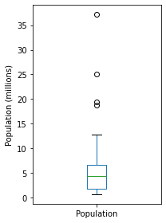
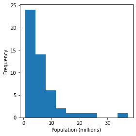
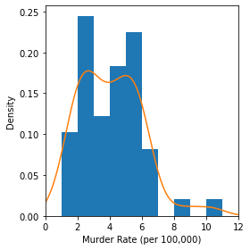
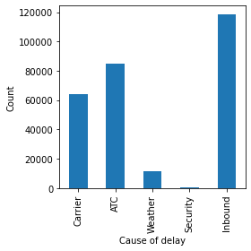
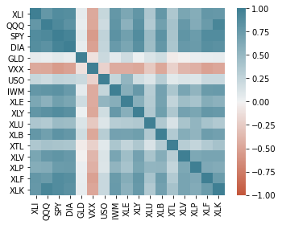
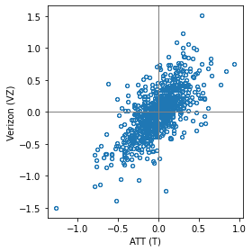
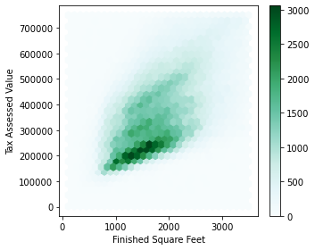
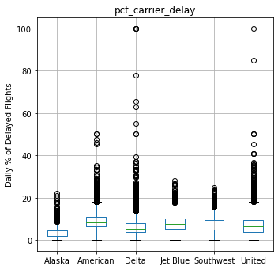
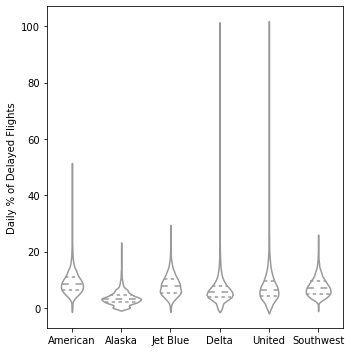
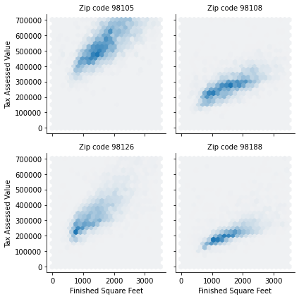

## EDA :탐색적 데이터 분석 
데이터를 요약하고 시각화하는 것을 통해 통차과 이해를 얻는 과정 

### 1.1 정형화된 데이터 요소 
* 수치형 데이터 : 숫자 이용해 표현할 수 있는 데이터 
    * 연속형 데이터 : 일정 범위 안 어떤 값이들 취할 수 있는 데이터 
    * 이산형 데이터 : 정수값만 취할 수 있는 데이터 
* 범주형 데이터 : 가능한 범주 안의 값만 취하는 데이터 
    * 이진 데이터 : 0과 1, 예/ 아니오 등 값만 취하는 데이터  
    * 순서형 데이터: 값들 사이에 순위가 있는 데이터 

### 1.2 테이블 데이터 
* 데이터 프레임 :  테이블 형태의 데이터 구조 
     * 레코드 - 행 / 열 - 피처  

### 1.3 위치 추정 
데이터 살펴보는 가장 기초적인 단계는 대푯값을 구하는 것으로 곧 대부분의 값이 어디쯤에 위치하는지 나타내는 추정값
* 평균 
* 가중평균 :  가중치를 곲한 값의 총합을 가중치의 총합으로 나눈 값 
* 중간값 : 데이터 정렬했을 때, 한가운데에 위치하는 값 
    * 가중중간값 : 데이터 정렬 후 해당하는 가중치 가지도록 설정
* 백분위수 : 전체 데이터의 p%를 아래에 두는 값
* 절사평균 : 정해진 개수의 극단값 제외한 나머지 값들의 평균
* 로버스트하다 :  극단값들에 대해 민감하지 않다
* 특이값 : (=극단값)

### 1.3.3 인구에 따른 살인 비율의 위치 추정 


```python
import pandas as pd

state = pd.read_csv('state.csv')
state.head(1)
```


<div>
<style scoped>
    .dataframe tbody tr th:only-of-type {
        vertical-align: middle;
    }

    .dataframe tbody tr th {
        vertical-align: top;
    }

    .dataframe thead th {
        text-align: right;
    }
</style>
<table border="1" class="dataframe">
  <thead>
    <tr style="text-align: right;">
      <th></th>
      <th>State</th>
      <th>Population</th>
      <th>Murder.Rate</th>
      <th>Abbreviation</th>
    </tr>
  </thead>
  <tbody>
    <tr>
      <th>0</th>
      <td>Alabama</td>
      <td>4779736</td>
      <td>5.7</td>
      <td>AL</td>
    </tr>
  </tbody>
</table>
</div>


```python
from scipy.stats import trim_mean
print('평균값:',state['Population'].mean())
print('절사평균:',trim_mean(state['Population'],0.1))
print('중앙값:',state['Population'].median())
```

    평균값: 6162876.3
    절사평균: 4783697.125
    중앙값: 4436369.5
    

중앙값 < 절사평균 < 평균값 


```python
import numpy as np
from statsmodels import robust
import wquantiles

#가중치 적용 
np.average(state['Murder.Rate'],weights=state['Population'])
```


    4.445833981123393


```python
#가중 중간값 
wquantiles.median(state['Murder.Rate'],weights=state['Population'])
```


    4.4


### 1.4 변이추정
변이란 데이터 특징을 요약하는 요소 중 하나로 데이터 값이 얼마나 밀집해 있는지 혹은 퍼져 있는지를 나타내는 산포도를 나타냄 
* 편차 : 관측값과 위치 추정값 사이의 차 (=오차,잔차)
       : 평균을 기준으로 편차의 합은 항상 0
* 분산 : 평균과 편차를 제곱한 값들의 합을 n-1로 나눈 값 
* 표준편차 : 분산의 제곱근 
* 평균절대편차 : 평균과의 편차의 절대값의 평균
* 중간값의 중위절대편차 : 중간값과의 편차의 절댓값의 중간값 
* 범위 : 최댓값과 최솟값의 차 
* 순서통계량 : 최소에서 최대까지 정렬된 데이터 값에 따른 계량형
* 백분위수 : 어떤 값들의 p퍼센트가 ㅇ이 값 혹은 더 작은 값을 갖거나, 더 큰 값을 갖도록 하는 값
* 사분위범위 : 75번째 백분위수와 25번째 백분위수 사이의 차 

### 1.4.3 주별 인구의 변이 추정


```python
# 표준편차 
print(state['Population'].std())
```

    6848235.347401142
    


```python
# 사분위 범위 
print(state['Population'].quantile(0.75) - state['Population'].quantile(0.25))
```

    4847308.0
    


```python
# 중위절편차 
print(robust.scale.mad(state['Population']))
```

    3849876.1459979336
    

* 표준편차는 MAD의 두배가 되는데 이는 표준편차는 특잇값에 민감하다는 것을 보여줌

### 1.5 데이터 분포 탐색하기 

### 1.5.1 백분위수와 상자그림


```python
# 주별 살인율의 백분위수 확인하기 
print(state['Murder.Rate'].quantile([0.05, 0.25, 0.5, 0.75, 0.95]))
```

    0.05    1.600
    0.25    2.425
    0.50    4.000
    0.75    5.550
    0.95    6.510
    Name: Murder.Rate, dtype: float64
    


```python
import matplotlib.pylab as plt

# 박스플롯으로 나타내기 
ax = (state['Population']/1_000_000).plot.box(figsize=(3, 4))
ax.set_ylabel('Population (millions)')

plt.tight_layout()
plt.show()
```


    

    


### 1.5.2 도수분포표와 히스토그램


```python
# 빈도 테이블 구하기 

binnedPopulation = pd.cut(state['Population'], 10)
binnedPopulation.value_counts()
```


    (526935.67, 4232659.0]      24
    (4232659.0, 7901692.0]      14
    (7901692.0, 11570725.0]      6
    (11570725.0, 15239758.0]     2
    (15239758.0, 18908791.0]     1
    (18908791.0, 22577824.0]     1
    (22577824.0, 26246857.0]     1
    (33584923.0, 37253956.0]     1
    (26246857.0, 29915890.0]     0
    (29915890.0, 33584923.0]     0
    Name: Population, dtype: int64


```python
# 위의 도수분포표를 히스토그램으로 나타내기 

ax = (state['Population'] / 1_000_000).plot.hist(figsize=(4, 4))
ax.set_xlabel('Population (millions)')

plt.tight_layout()
plt.show()
```


    

    


히스토그램을 통해 
* 빈 구간의 존재 여부 확인
* 동일 크기 구간 갖는 것을 확인 
* 구간 수 사용자 결정할 수 있음
* 빈 구간이 있지 않는 이상, 서로 붙어서 그려짐

### 1.5.3 밀도 그림과 추정 
밀도 그림은 데이터의 분포를 연속된 선으로 보여줌


```python
# 주별 살인율 밀도 확인
ax = state['Murder.Rate'].plot.hist(density=True, xlim=[0, 12], 
                                    bins=range(1,12), figsize=(4, 4))
state['Murder.Rate'].plot.density(ax=ax)
ax.set_xlabel('Murder Rate (per 100,000)')

plt.tight_layout()
plt.show()
```


    

    


### 1.6 이진데이터와 범주 데이터 탐색하기 


```python
import pandas as pd

dfw= pd.read_csv('dfw_airline.csv')
dfw.head(1)
```


<div>
<style scoped>
    .dataframe tbody tr th:only-of-type {
        vertical-align: middle;
    }

    .dataframe tbody tr th {
        vertical-align: top;
    }

    .dataframe thead th {
        text-align: right;
    }
</style>
<table border="1" class="dataframe">
  <thead>
    <tr style="text-align: right;">
      <th></th>
      <th>Carrier</th>
      <th>ATC</th>
      <th>Weather</th>
      <th>Security</th>
      <th>Inbound</th>
    </tr>
  </thead>
  <tbody>
    <tr>
      <th>0</th>
      <td>64263.16</td>
      <td>84856.5</td>
      <td>11235.42</td>
      <td>343.15</td>
      <td>118427.82</td>
    </tr>
  </tbody>
</table>
</div>


```python
# 범주형 데이터 막대그래프로 나타내기 
ax = dfw.transpose().plot.bar(figsize=(4, 4), legend=False) #transepose함수는 행과 열을 바꿔줌
ax.set_xlabel('Cause of delay')
ax.set_ylabel('Count')

plt.tight_layout()
plt.show()
```


    

    


* 막대도표와 히스토그램은 유사하지만 막대도표의 x축은 각 요인 변수의 서로 다른 범주들을 나타냄.
  반면, 히스토그램으니 x축은 수치적으로 나타낼 수 있는 하나의 변수 값을 의미 

### 1.7 상관관계
예측값들 간 혹은 예측값과 목푯값과의 상관관계 역시 탐색적 데이터 분석 중 하나로 상관계수는 완전한 양의 상관관계 +1과 완전한 음의 상관관계 -1 사이에만 존재 


```python
import pandas as pd

sp500_sym= pd.read_csv('sp500_sectors.csv')
sp500_sym.head(1)
```


<div>
<style scoped>
    .dataframe tbody tr th:only-of-type {
        vertical-align: middle;
    }

    .dataframe tbody tr th {
        vertical-align: top;
    }

    .dataframe thead th {
        text-align: right;
    }
</style>
<table border="1" class="dataframe">
  <thead>
    <tr style="text-align: right;">
      <th></th>
      <th>sector</th>
      <th>sector_label</th>
      <th>sub_sector</th>
      <th>symbol</th>
    </tr>
  </thead>
  <tbody>
    <tr>
      <th>0</th>
      <td>information_technology</td>
      <td>Technology</td>
      <td>data_processing_&amp;_outsourced_services</td>
      <td>ADS</td>
    </tr>
  </tbody>
</table>
</div>


```python
import pandas as pd

sp500_px= pd.read_csv('sp500_data.csv',index_col=0)
sp500_px.head(1)
```


<div>
<style scoped>
    .dataframe tbody tr th:only-of-type {
        vertical-align: middle;
    }

    .dataframe tbody tr th {
        vertical-align: top;
    }

    .dataframe thead th {
        text-align: right;
    }
</style>
<table border="1" class="dataframe">
  <thead>
    <tr style="text-align: right;">
      <th></th>
      <th>ADS</th>
      <th>CA</th>
      <th>MSFT</th>
      <th>RHT</th>
      <th>CTSH</th>
      <th>CSC</th>
      <th>EMC</th>
      <th>IBM</th>
      <th>XRX</th>
      <th>ALTR</th>
      <th>...</th>
      <th>WAT</th>
      <th>ALXN</th>
      <th>AMGN</th>
      <th>BXLT</th>
      <th>BIIB</th>
      <th>CELG</th>
      <th>GILD</th>
      <th>REGN</th>
      <th>VRTX</th>
      <th>HSIC</th>
    </tr>
  </thead>
  <tbody>
    <tr>
      <th>1993-01-29</th>
      <td>0.0</td>
      <td>0.060124</td>
      <td>-0.0221</td>
      <td>0.0</td>
      <td>0.0</td>
      <td>0.018897</td>
      <td>0.007368</td>
      <td>0.092165</td>
      <td>0.25914</td>
      <td>-0.007105</td>
      <td>...</td>
      <td>0.0</td>
      <td>0.0</td>
      <td>0.34716</td>
      <td>0.0</td>
      <td>0.04167</td>
      <td>0.0</td>
      <td>0.015564</td>
      <td>1.75</td>
      <td>0.125</td>
      <td>0.0</td>
    </tr>
  </tbody>
</table>
<p>1 rows × 517 columns</p>
</div>


```python
etfs = sp500_px.loc[sp500_px.index > '2012-07-01', 
                    sp500_sym[sp500_sym['sector'] == 'etf']['symbol']]
print(etfs.head())
```

                     XLI       QQQ       SPY       DIA       GLD    VXX       USO  \
    2012-07-02 -0.376098  0.096313  0.028223 -0.242796  0.419998 -10.40  0.000000   
    2012-07-03  0.376099  0.481576  0.874936  0.728405  0.490006  -3.52  0.250000   
    2012-07-05  0.150440  0.096313 -0.103487  0.149420  0.239991   6.56 -0.070000   
    2012-07-06 -0.141040 -0.491201  0.018819 -0.205449 -0.519989  -8.80 -0.180000   
    2012-07-09  0.244465 -0.048160 -0.056445 -0.168094  0.429992  -0.48  0.459999   
    
                     IWM       XLE       XLY       XLU       XLB       XTL  \
    2012-07-02  0.534641  0.028186  0.095759  0.098311 -0.093713  0.019076   
    2012-07-03  0.926067  0.995942  0.000000 -0.044686  0.337373  0.000000   
    2012-07-05 -0.171848 -0.460387  0.306431 -0.151938  0.103086  0.019072   
    2012-07-06 -0.229128  0.206706  0.153214  0.080437  0.018744 -0.429213   
    2012-07-09 -0.190939 -0.234892 -0.201098 -0.035751 -0.168687  0.000000   
    
                     XLV       XLP       XLF       XLK  
    2012-07-02 -0.009529  0.313499  0.018999  0.075668  
    2012-07-03  0.000000  0.129087  0.104492  0.236462  
    2012-07-05 -0.142955 -0.073766 -0.142490  0.066211  
    2012-07-06 -0.095304  0.119865  0.066495 -0.227003  
    2012-07-09  0.352630 -0.064548  0.018999  0.009457  
    


```python
import seaborn as sns

# 히트맵을 통해서 상관관계 시각화 
fig, ax = plt.subplots(figsize=(5, 4))
ax = sns.heatmap(etfs.corr(), vmin=-1, vmax=1, 
                 cmap=sns.diverging_palette(20, 220, as_cmap=True),
                 ax=ax)

plt.tight_layout()
plt.show()
```


    

    


* 위의 히트맵은 주요 상장 주식 펀드들의 일간 수익 사이의 상관관계를 확인한 것으로 SPY와 DIA가 높은 상관성을 갖음을 알 수 있다
* 1.00 으로 갈수록 양의 상관관계 반대는 음의 상관관계를 나타내며 GLD,USO.VXX등과 관련된 안정적인 주요 상장 주식 펀드(ETF)들은 다른 ETF와 약한 혹은 음의 상관관계를 띄고 있음

### 1.7.1 산점도
두 변수 사이의 관계를 시각화하는 가장 기본적인 방법


```python
telecomSymbols = sp500_sym[sp500_sym['sector'] == 'telecommunications_services']['symbol']

telecom = sp500_px.loc[sp500_px.index >= '2012-07-01', telecomSymbols]
telecom.corr()
print(telecom)
```

                       T       CTL       FTR        VZ      LVLT
    2012-07-02  0.422496  0.140847  0.070879  0.554180 -0.519998
    2012-07-03 -0.177448  0.066280  0.070879 -0.025976 -0.049999
    2012-07-05 -0.160548 -0.132563  0.055128 -0.051956 -0.180000
    2012-07-06  0.342205  0.132563  0.007875  0.140106 -0.359999
    2012-07-09  0.136883  0.124279 -0.023626  0.253943  0.180000
    ...              ...       ...       ...       ...       ...
    2015-06-25  0.049342 -1.600000 -0.040000 -0.187790 -0.330002
    2015-06-26 -0.256586  0.039999 -0.070000  0.029650 -0.739998
    2015-06-29 -0.098685 -0.559999 -0.060000 -0.504063 -1.360000
    2015-06-30 -0.503298 -0.420000 -0.070000 -0.523829  0.199997
    2015-07-01 -0.019737  0.080000 -0.050000  0.355811  0.139999
    
    [754 rows x 5 columns]
    


```python
ax = telecom.plot.scatter(x='T', y='VZ', figsize=(4, 4), marker='$\u25EF$')
ax.set_xlabel('ATT (T)')
ax.set_ylabel('Verizon (VZ)')
ax.axhline(0, color='grey', lw=1)
ax.axvline(0, color='grey', lw=1)

plt.tight_layout()
plt.show()
```


    

    


* 위의 그래프를 살펴보면 ATT주식과 Verizon주식은 강한 양의 상관성을 보여줌
* 두 주식은 함께 오르거나 함께 떨어지거나 하는 경우가 많음

### 1.8 두개 이상의 변수 탐색하기 

### 1.8.1 육각형 구간과 등고선 


```python
import pandas as pd

# 워싱턴주에 위치한 킹 카운티의 주택시설에 대한 과세 평가 금액 정보 담고 있는 데이터
kc_tax= pd.read_csv('kc_tax.csv')
print(kc_tax.shape)
kc_tax.head(1)
```

    (498249, 3)
    


<div>
<style scoped>
    .dataframe tbody tr th:only-of-type {
        vertical-align: middle;
    }

    .dataframe tbody tr th {
        vertical-align: top;
    }

    .dataframe thead th {
        text-align: right;
    }
</style>
<table border="1" class="dataframe">
  <thead>
    <tr style="text-align: right;">
      <th></th>
      <th>TaxAssessedValue</th>
      <th>SqFtTotLiving</th>
      <th>ZipCode</th>
    </tr>
  </thead>
  <tbody>
    <tr>
      <th>0</th>
      <td>NaN</td>
      <td>1730</td>
      <td>98117.0</td>
    </tr>
  </tbody>
</table>
</div>


```python
# 데이터 필터링 (아주 비싸거나 너무 작거나 큰 주택들 제거)
kc_tax0 = kc_tax.loc[(kc_tax.TaxAssessedValue < 750000) & 
                     (kc_tax.SqFtTotLiving > 100) &
                     (kc_tax.SqFtTotLiving < 3500), :]
print(kc_tax0.shape)
```

    (432693, 3)
    


```python
#집의 크기와 과세평가액 나타낸 육각형 구간 도표 
ax = kc_tax0.plot.hexbin(x='SqFtTotLiving', y='TaxAssessedValue',
                         gridsize=30, sharex=False, figsize=(5, 4))
ax.set_xlabel('Finished Square Feet')
ax.set_ylabel('Tax Assessed Value')

plt.tight_layout()
plt.show()
```


    

    


```python
'''
등고선으로 나타내는 방법이지만 돌릴 경우 에러로 인해 주석으로 처리 

등고선으로 나타내기 
fig, ax = plt.subplots(figsize=(4, 4))
sns.kdeplot(data=kc_tax0, x='SqFtTotLiving', y='TaxAssessedValue', ax=ax)
ax.set_xlabel('Finished Square Feet')
ax.set_ylabel('Tax Assessed Value')

plt.tight_layout()
plt.show() 
'''
```


    "\n등고선으로 나타내는 방법이지만 돌릴 경우 에러로 인해 주석으로 처리 \n\n등고선으로 나타내기 \nfig, ax = plt.subplots(figsize=(4, 4))\nsns.kdeplot(data=kc_tax0, x='SqFtTotLiving', y='TaxAssessedValue', ax=ax)\nax.set_xlabel('Finished Square Feet')\nax.set_ylabel('Tax Assessed Value')\n\nplt.tight_layout()\nplt.show() \n"


### 1.8.2 범주형 변수 대 범주형 변수 


```python
lc_loans = pd.read_csv('lc_loans.csv')
lc_loans.head(1)
```


<div>
<style scoped>
    .dataframe tbody tr th:only-of-type {
        vertical-align: middle;
    }

    .dataframe tbody tr th {
        vertical-align: top;
    }

    .dataframe thead th {
        text-align: right;
    }
</style>
<table border="1" class="dataframe">
  <thead>
    <tr style="text-align: right;">
      <th></th>
      <th>status</th>
      <th>grade</th>
    </tr>
  </thead>
  <tbody>
    <tr>
      <th>0</th>
      <td>Fully Paid</td>
      <td>B</td>
    </tr>
  </tbody>
</table>
</div>


분할표는 두 범주형 변수 요약하는데 좋으며 범주별 빈도수를 기록한 표이다  
아래의 표는 위의 두개 변수를 통해서 분할표로 나타낸 것


```python
crosstab = lc_loans.pivot_table(index='grade', columns='status', 
                                aggfunc=lambda x: len(x), margins=True)
print(crosstab)
```

    status  Charged Off  Current  Fully Paid  Late     All
    grade                                                 
    A              1562    50051       20408   469   72490
    B              5302    93852       31160  2056  132370
    C              6023    88928       23147  2777  120875
    D              5007    53281       13681  2308   74277
    E              2842    24639        5949  1374   34804
    F              1526     8444        2328   606   12904
    G               409     1990         643   199    3241
    All           22671   321185       97316  9789  450961
    


```python
#비율로 나타낸 방법
df = crosstab.copy().loc['A':'G',:]
df.loc[:,'Charged Off':'Late'] = df.loc[:,'Charged Off':'Late'].div(df['All'], axis=0)
df['All'] = df['All'] / sum(df['All'])
perc_crosstab = df
print(perc_crosstab)
```

    status  Charged Off   Current  Fully Paid      Late       All
    grade                                                        
    A          0.021548  0.690454    0.281528  0.006470  0.160746
    B          0.040054  0.709013    0.235401  0.015532  0.293529
    C          0.049828  0.735702    0.191495  0.022974  0.268039
    D          0.067410  0.717328    0.184189  0.031073  0.164708
    E          0.081657  0.707936    0.170929  0.039478  0.077177
    F          0.118258  0.654371    0.180409  0.046962  0.028614
    G          0.126196  0.614008    0.198396  0.061401  0.007187
    

### 1.8.3 범주형 변수 대 수치형 변수


```python
airline_stats = pd.read_csv('airline_stats.csv')
airline_stats.head()
```


<div>
<style scoped>
    .dataframe tbody tr th:only-of-type {
        vertical-align: middle;
    }

    .dataframe tbody tr th {
        vertical-align: top;
    }

    .dataframe thead th {
        text-align: right;
    }
</style>
<table border="1" class="dataframe">
  <thead>
    <tr style="text-align: right;">
      <th></th>
      <th>pct_carrier_delay</th>
      <th>pct_atc_delay</th>
      <th>pct_weather_delay</th>
      <th>airline</th>
    </tr>
  </thead>
  <tbody>
    <tr>
      <th>0</th>
      <td>8.153226</td>
      <td>1.971774</td>
      <td>0.762097</td>
      <td>American</td>
    </tr>
    <tr>
      <th>1</th>
      <td>5.959924</td>
      <td>3.706107</td>
      <td>1.585878</td>
      <td>American</td>
    </tr>
    <tr>
      <th>2</th>
      <td>7.157270</td>
      <td>2.706231</td>
      <td>2.026706</td>
      <td>American</td>
    </tr>
    <tr>
      <th>3</th>
      <td>12.100000</td>
      <td>11.033333</td>
      <td>0.000000</td>
      <td>American</td>
    </tr>
    <tr>
      <th>4</th>
      <td>7.333333</td>
      <td>3.365591</td>
      <td>1.774194</td>
      <td>American</td>
    </tr>
  </tbody>
</table>
</div>


```python
ax = airline_stats.boxplot(by='airline', column='pct_carrier_delay',
                           figsize=(5, 5)) # by사용해서 항공사별로 분리 가능 
ax.set_xlabel('')
ax.set_ylabel('Daily % of Delayed Flights')
plt.suptitle('')

plt.tight_layout()
plt.show()
```


    

    


다음의 박스플롯 그래프를 살펴본 결과 아메리칸 항공의 지연이 가장 많은 것으로 보이고 알래스카 항공의 지연이 가장 낮은 것으로 보인다


```python
fig, ax = plt.subplots(figsize=(5, 5))
sns.violinplot(data=airline_stats, x='airline', y='pct_carrier_delay',
               ax=ax, inner='quartile', color='white')
ax.set_xlabel('')
ax.set_ylabel('Daily % of Delayed Flights')

plt.tight_layout()
plt.show()
```


    

    


박스플롯의 그래프를 위의 그래프처럼 바이올린 도표를 통해 나타낸다면 밀도추정 결과를 시각화하여서 데이터의 분포를 볼 수 있다. 그치만 데이터의 특잇값들은 박스플롯 그래프에서 더 쉽게 확인할 수 있다

### 1.8.4 다변수 시각화하기


```python
zip_codes = [98188, 98105, 98108, 98126]
kc_tax_zip = kc_tax0.loc[kc_tax0.ZipCode.isin(zip_codes),:]
kc_tax_zip

g = sns.FacetGrid(kc_tax_zip, col='ZipCode', col_wrap=2)
g.map(hexbin, 'SqFtTotLiving', 'TaxAssessedValue', 
      extent=[0, 3500, 0, 700000])
g.set_axis_labels('Finished Square Feet', 'Tax Assessed Value')
g.set_titles('Zip code {col_name:.0f}')

plt.tight_layout()
plt.show()
```


    

    


다음과 같이 조건화를 여러 변수를 비교하는 용도로 확장하여 사용할 수 있고 위의 그래프는 주택 크기와 과세 평가액 간의 관계를 나타내는 그래프로 단위넓이당 더 높은 과세 평가 금액을 보였던 무리의 주택들을 알 수 있게 된다
